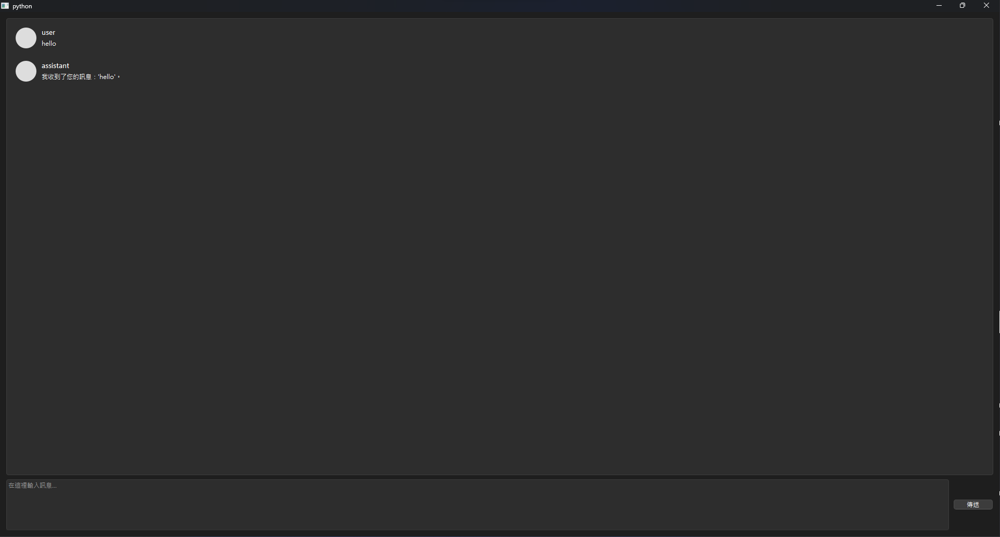

# PyQt6-ChatUI-Example

該專案為一個簡單的 PyQt6 **Chat UI** 展示。

## 起源
*   因為我在開源社區找不太到 Chat UI 的範例，所以我就跟 Gemini 討論了一下 做出這個簡易的 UI。

## 使用
*   使用時務必修改 **Message** class 當中的 **ai_response** function。
*   聊天歷史紀錄依賴於 文件開頭的 `MESSAGE` 變數。

## 截圖
